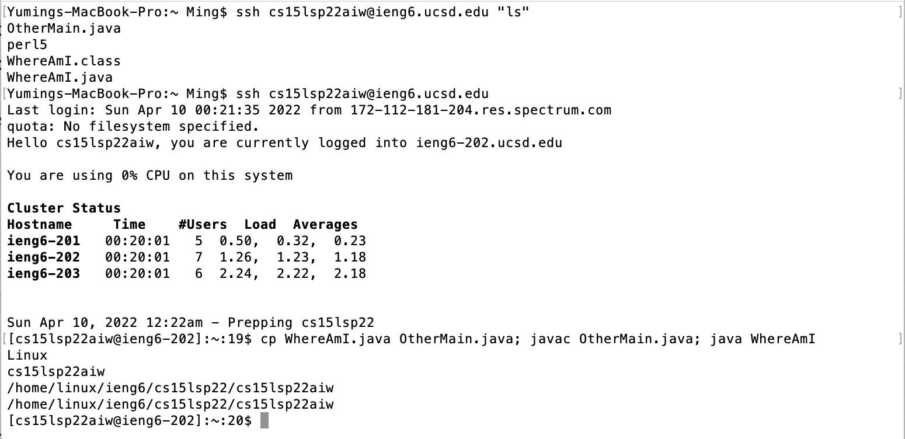

# [CSE 15L Lab Report 1](https://yuming73.github.io/cse15l-lab-reports/lab-report-1-week-2.html)  
## How To Log Into A Course-Specific Account On `ieng6`     
    
**Step 1**   
**Installing VScode**     
1. Follow the instructions on [this website](https://code.visualstudio.com/) to download and install Visual Studio Code on the computer   
2. When successfully installed and opened, you should see a page similar to this:   
    

---

**Step 2**   
**Remotely Connecting**  
*Prestep For Microsoft Users: [Install OpenSSH](https://docs.microsoft.com/en-us/windows-server/administration/openssh/openssh_install_firstuse)*    
*Look Up Course Specific Account: [Here](https://sdacs.ucsd.edu/~icc/index.php)*    
1. Open a terminal in VSCode and run the command: `$ ssh cs15lsp22zz@ieng6.ucsd.edu` (replaced *`zz`* with the last three letters in your course specific account)  
2. Say yes to the "*Are you sure you want to continue connecting*" messages if connecting to the server for the first time  
3. Provide your password and the terminal should look something similar to this to indicate that you are logged in:  
   

---

**Step 3**  
**Trying Some Commands**    
Here's a list of suggestions of commands to try out:
* `cd` (change directory: changes the current working directory)
* `ls` (list: list the names of the files in the current working directory) 
* `ls -l` (list long: list the file names, protection information, file owner, modified date and time, and number of characters in the file)  
* `ls -a` (list all: list all the files in the current working directory, including those with period and hidden files)
* `ls -t` (list time: list the files sorted based on the modification time, with the last edited file at the top of the list)
* `ls -lat` (a combination of the above three `ls` commands)
* Ctrl-D or `exit` (logs you out of the remote server in the terminal)
* `cp /home/linux/ieng6/cs15lsp22/public/hello.txt ~/` (copy: copies files and directories to another location)  
* `cat /home/linux/ieng6/cs15lsp22/public/hello.txt` (concatenate: creates single/multiple files, view content of a file, and concatenate files)    

*Notice that when trying the last two commands, you might encounter something like this, indicating that permission is denied from accessing the file, which means there's no permission to open or read the file:*  
     

---

**Step 4**  
**Moving Files With `scp`**   
1. Create a file on your computer called `WhereAmI.java` with the following contents:
```
class WhereAmI {
    public static void main(String[] args) {
    System.out.println(System.getProperty("os.name"));
    System.out.println(System.getProperty("user.name"));
    System.out.println(System.getProperty("user.home"));
    System.out.println(System.getProperty("user.dir"));
  }
}
```
2. In the directory of the file, run the command: `scp WhereAmI.java cs15lsp22zz@ieng6.ucsd.edu:~/` (replaced *`zz`* with the last three letters in your course specific account) and provide your password
3. Log into `ieng6` with `ssh` and run the `ls` command to check that the file has successfully been copied
4. The terminal should look similar to this in this process:   
    
    
5. You can use `javac` and `java` to observe the difference between the outputs from running on the client (local computer) vs. running on the server (remote server)  
*Notice that the computer system, username, and user directory are different when run on the client versus the server. This means that the `getProperty` method in the `WhereAmI` class returns the specific properties (computer system, username, user directory) of a file based on whether it’s on the client or the server.*    

---

**Step 5**   
**Setting an SSH Key**    
1. On the client (local computer), run the command: `ssh-keygen`, **do not add a passphrase for this step**
2. Log into `ieng6` with `ssh` and copy the public key to the `.ssh` directory of your user account on the server with the command: `mkdir .ssh`   
3. Log out of the server and on client, run the command: `scp /Users/<user-name>/.ssh/id_rsa.pub cs15lsp22zz@ieng6.ucsd.edu:~/.ssh/authorized_keys` (replaced with your username)
4. When prompt to select a path, use the path you saw in the command above   
5. You should now be able to log into `ieng6` without a password, with a terminal similar to this:  
   

---

**Step 6**   
**Optimizing Remote Running**   
Ways to optimize the process of locally editing files, copying files to remote server, and running it:    
* Set up an SSH key in place of a password: from our lab experiment, we found out that the process of editing and copying a file from local to remote can be reduced by approximately 18 seconds when a password is not required.    
* Copy and paste commands, or use the up arrows to call the previous commands   
* Use semicolons (;) to run multiple commands on the same line   
* Write the command in quotation marks ("") at the end of an `ssh` command to directly run it on the remote server   
For example, by running the command: `$ ssh cs15lsp22zz@ieng6.ucsd.edu "ls"`, (replaced *`zz`* with last three letters in the account name) all the files in the remote server is listed without running a second command:  
   

---