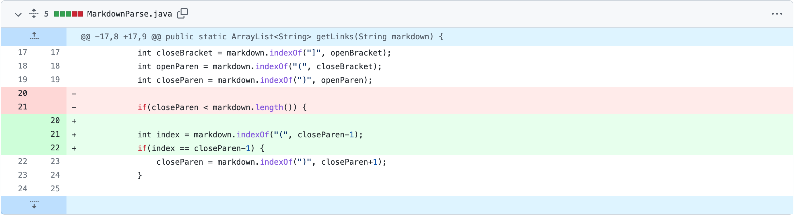
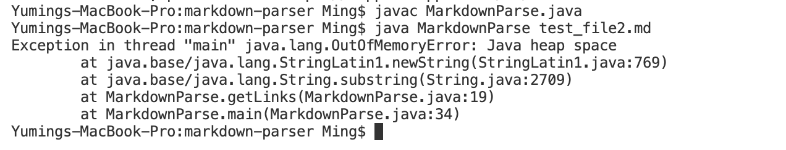
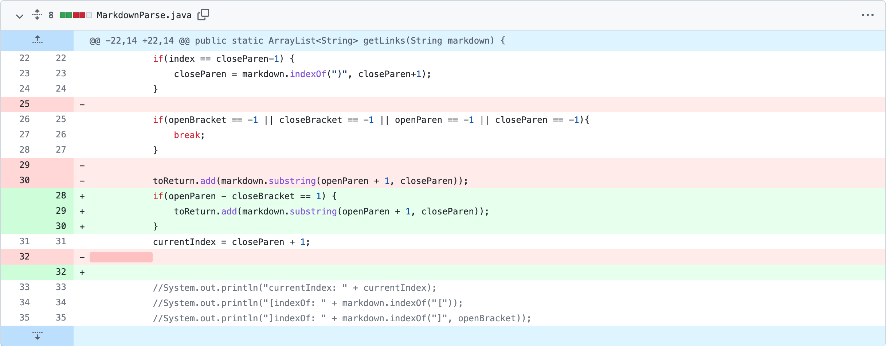
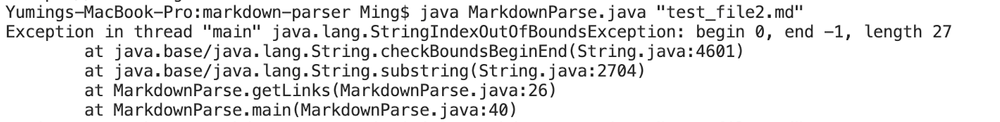
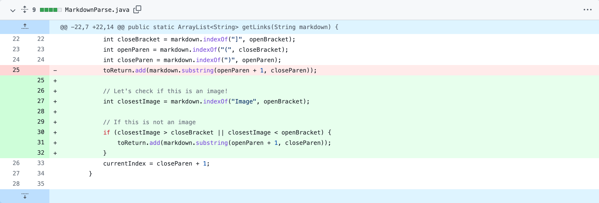

# [CSE 15L Lab Report 2](https://yuming73.github.io/cse15l-lab-reports/lab-report-2-week-4.html)    
## Examples of Debugging    

### 1. First Example - Runtime Error    
* **Bug:** The flaw in the previous code is that the while loop did not check for conditions when the link contains parentheses.    
* **Code Changes:** If the difference between the indices of the close and open parentheses is zero, then the parentheses is empty with no links. The program will search for a new index of the close parenthesis that contains a valid link, starting from the previously stored value of the `closeParen` variable.    
    
* **[Test File:](https://github.com/yuming73/markdown-parser/commit/c8a4acc428375c279d1824fb3340ee390fa525dd)** This file contains the failure-inducing input, which caused a runtime error because the program mistakenly took the parentheses within the link to be the outer parentheses that contain the link.    
* **Symptom:** A `java.lang.OutOfMemoryError` is indicated as followed, depicting a runtime error. Specifically, the error resulted from an infinite loop as the program continue to iterate to find the close parenthesis and never break from the while loop.    
    

*As a flaw in the computer system, the bug is the result of the symptom, which in turn is a faulty program behavior that results from the failure-inducing input. In this case, the file containing the link `https://something.com` is the failure-inducing input. In processing this file, the symptom appear as a runtime error. From the error message, the bug can be identify to locate at line 19 in the `getLinks()` class, or the `toReturn.add(markdown.substring(openParen+1, closeParen))` code. Through debugging, it can be determined that the bug results from an infinite loop and can be fix by adding an if statement to continue the search for the close parenthesis at a new index when the link contains parentheses. Knowing the failure-inducing input and the symptom helps with the debugging process.*    

---   

### 2. Second Example - Unchecked Exception    
* **Bug:** The flaw in the previous code is that the while loop did not check for conditions when there are incomplete or no parentheses and brackets in the file.    
* **Code Changes:** If any of the `openBracket`, `closeBracket`, `openParen`, `closeParen` variables are set to an index of -1, then the parentheses and brackets in the file either do not exist or are not complete. The program will break from the while loop as a result.    
    
* **[Test File:](https://github.com/yuming73/markdown-parser/commit/8d20e8d24ce16085bd3f9109ffabed8e2b8fe2f0)** This file contains the failure-inducing input, which caused an index out of bounds exception because the program did not take into account that the file does not contain any parentheses.    
* **Symptom:** An `java.lang.StringIndexOutOfBoundsException` is thrown as followed, depicting an unchecked exception. Specifically, the exception resulted from the `closeParen` and `openParen` variables being set to an index of -1 because no parentheses are found in the file.    
   

*In this example, the failure-inducing input is the file containing an empty bracket and some texts but no parentheses. In processing this file, the symptom appear as an index out of bounds exception at runtime. From the error message, the bug can be identify to locate at line 26 in the `getLinks()` class, or the `toReturn.add(markdown.substring(openParen+1, closeParen))` code. The debugging process helps to determine that the bug is a logical error and results from setting the `closeParen` and `openParen` variables to an index of -1. By viewing the failure-inducing input and the symptom, this bug can be fix by adding an if statement to break the while loop if there are incomplete or no brackets and parentheses.*    

---   

### 3. Third Example - Incorrect Output    
* **Bug:** The flaw in the previous code is that the while loop did not check for conditions when the link within the parentheses directs to an image rather than a website.    
* **Code Changes:** If the indices of the text "image" is greater than the `closeBracket` index and less than the `openBracket` index, then the link within the parentheses is valid and not directed to an image. The program will add the contained link to the arraylist.    
    
* **[Test File:](https://github.com/yuming73/markdown-parser/commit/43c5b82c125c0f295edeaa01462997f54ff0b654)** This file contains the failure-inducing input, which caused an incorrect output because the program did not check whether the link is directed to a website or an image.    
* **Symptom:** Since the link contained within the parentheses is directed to an image, the expected output is `[]`, but the actual output is `[page.com]`, depicting an incorrect output is produced. Specifically, the wrong answer resulted from the program taking in any links that are contained within parentheses.    
    

*In this case, the failure-inducing input is the file that contains ``, indicating the link is directed to an image. In processing this file in the `main`, the symptom appear as an incorrect output because the list with a link is return when an empty list is expected. This bug is a logical error and results from not checking the validity of the link, or whether or not it is a website link. Viewing the failure-inducing input and the symptom helps to fix this bug by adding an if statement to check whether the link directs to a website before adding it to the arraylist.*    

---   