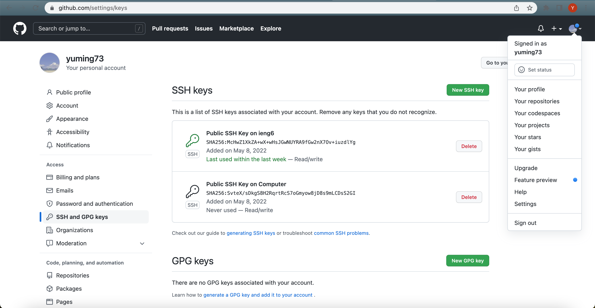

# [CSE 15L Lab Report 3](https://yuming73.github.io/cse15l-lab-reports/lab-report-3-week-6.html)    
## Group Choice Options From Lab 5    

### Option 1- Streamlinging ssh Configuration    
1.   
   
2.   
   
3.    
   

---   

### Option 2- Setup Github Access From ieng6   
1.   
   
2.    
   
   
   
3.   
   
4. [link](https://github.com/yuming73/Skill-Demonstration/commit/b6717595e1d39a08ccb34328da57c4a85263d700) [link2](https://github.com/yuming73/Skill-Demonstration/commit/b6717595e1d39a08ccb34328da57c4a85263d700)   
   
---   

### Option 3- Copy Whole Directories With `scp -r`   
1.    
   
2.    
   
3.   
   
4.   
   
   
   

---   