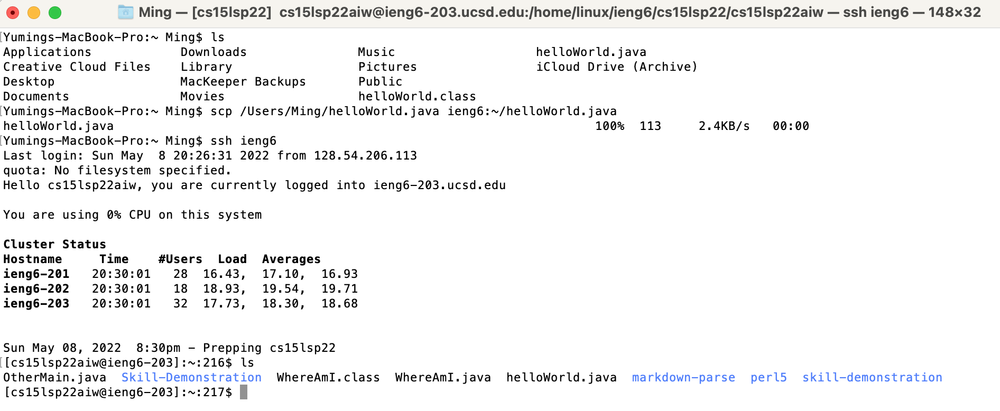

# [CSE 15L Lab Report 3](https://yuming73.github.io/cse15l-lab-reports/lab-report-3-week-6.html)    
## Group Choice Options From Lab 5    

### Option 1- Streamlinging ssh Configuration    
1. Create a `.ssh/config` file using the command `vim ~/.ssh/config` in the terminal. The file should contain the hostname and the user of the remote host `ieng6`. To save the file after editing, click on `esc` and type `:wq`, which means to save and exit.    
   
2. We should now be able to log onto the `ieng6` remote server just by using the command `ssh ieng6`, in which case the `ieng6` is a shortened alias for our account name.  
   
3. We can also use the `scp` command to copy files to the remote account with just the `ieng6` alias.    
   

---   

### Option 2- Setup Github Access From ieng6   
1. The public `ssh` key can be found in Github by going to settings, then to SSH and GPG keys under the Access section.    
   
2. In `ieng6`, the public and private `ssh` keys are both stored in the `~./ssh` directory.    
   
   
   
3. To commit and push a change while logged into the `ieng6` account, use `git add` to add the files that are changed, then `git commit` to commit the changes with a commit message, and then `git push origin main` to push the changes to the main.   
*Note: to set the origin to be the Github repository, use the command `git remote set-url origin <ssh repository URL>`.*   
   
4. Here's the [link](https://github.com/yuming73/Skill-Demonstration/commit/b6717595e1d39a08ccb34328da57c4a85263d700) to the resulting commit for the changes of creating `skillDemo1.class` and `testskillDemo1.class`.   
   
---   

### Option 3- Copy Whole Directories With `scp -r`   
1. First, determine the path of the directory with the command `pwd`. Then, use the command `scp -r . <username>@ieng6.ucsd.edu:~/<directory>` to copy the directory into the `ieng6` remote server.   
   
2. Log onto the `ieng6` server with `ssh ieng6` and use the `ls` command to check that all files within the directory is copied.   
   
3. Go to the directory with the `cd` command and use the `javac` and `java` commands to make sure that the files in the directory can be compiled and ran.   
   
4. We can also copy the directory to `ieng6` and run the files within the directory in one line by using a semicolon `;` to separate the commands. An example of putting the `scp` and `ssh` commands in one line would be: `scp -r .ieng6:<directory name>; ssh ieng6 'cd <directory name>; javac <file name>.java; java <file name> `.   
   
   
5. We can log onto the `ieng6` server and check that the directory has been copied and the files can be compiled and ran.    
   

---   