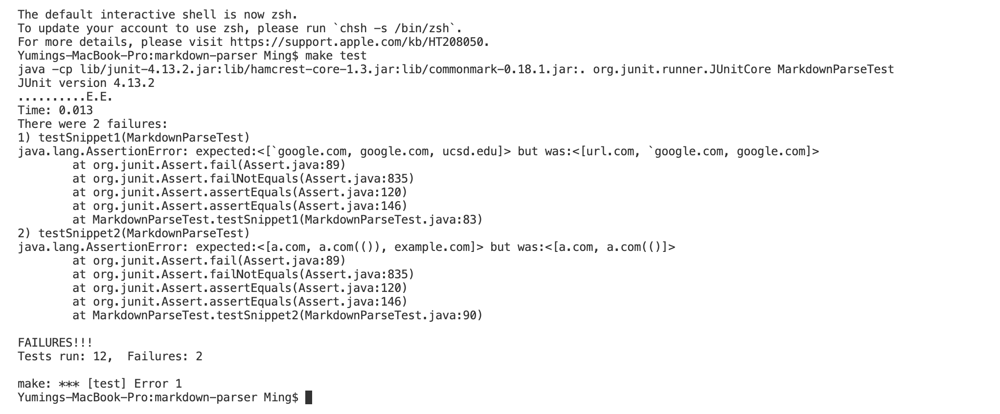

# [CSE 15L Lab Report 4](https://yuming73.github.io/cse15l-lab-reports/lab-report-4-week-8.html)    
## Snippet Code Reviews    

**[My Repository Link](https://github.com/yuming73/markdown-parser.git)**   
**[Reviewed Repository Link](https://github.com/Sking56/markdown-parser.git)**   

**Expected Output of the Snippets:**    
1. Snippet 1: the expected output is ``[`google.com, google.com, ucsd.edu]``   
   
2. Snippet 2: the expected output is `[a.com(()), example.com]`   
   
3. Snippet 3: the expected output is `[https://sites.google.com/eng.ucsd.edu/cse-15l-spring-2022/schedule]`   
   

**Tests in `MarkdownParseTest.java`**   
* *I created a new file for each snippet and added the tests for each snippet file.*   
   
    
**Output From My `MarkdownParse.java` Implementation**     
* *All three tests for the Snippets failed as shown in the image below, detailing the specific JUnit output*   
   
* **Snippet Test 1 Possible Code Change:** A small code change to account for inline backticks is to check if there is backticks in front of the `closeBracket`, similarly like how an image link is checked. Another change is to check if there are backticks after a inner bracket within the outer brackets, and if so, increment the `closeBracket` to the correct outer bracket index. However, these changes are based on the condition that the test cases are visible, so it might not work for some test cases concerning inline backticks.    
* **Snippet Test 2 Possible Code Change:** I don't see a small code change to account for nest parentheses, brackets, and escaped brackets because it would involve changing multiple parts of the current codes. This might cause other test cases to fail because my code was initially written based on the those cases within the prior test files. My initial code only checks if the link contains a single parenthese, so it might require a more involved change to check if the link contains more than one parenthese.    
* **Snippet Test 3 Possible Code Change:** A small code change to account for newlines in brackets and parentheses is to check if there are any spaces within the link in the parentheses. If so, skip the iteration because it would not be a valid link with spaces. Another change is to remove any spaces before and after the link in the parentheses by using the `trim()` function. Since these changes are based on the condition that the test cases are visible, it might not work for some test cases concerning newlines in brackets and parentheses.     

**Output From Reviewed `MarkdownParse.java` Implementation**   
* *All three tests for the Snippets failed as shown in the image below, detailing the specific JUnit output*   
   

---    