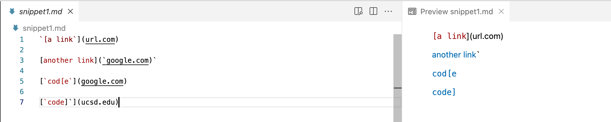

# [CSE 15L Lab Report 4](https://yuming73.github.io/cse15l-lab-reports/lab-report-4-week-8.html)    
## Snippet Code Reviews    

**[My Repository Link](https://github.com/yuming73/markdown-parser.git)**   
**[Reviewed Repository Link](https://github.com/Sking56/markdown-parser.git)**   

**Expected Output of the Snippets:**    
1. Snippet 1: the expected output is ``[`google.com, google.com, ucsd.edu]``   
   
2. Snippet 2: the expected output is `[a.com(()), example.com]`   
   
3. Snippet 3: the expected output is `[https://sites.google.com/eng.ucsd.edu/cse-15l-spring-2022/schedule]`   
   

**Tests in `MarkdownParseTest.java`**   
*I created a new file for each snippet and added the tests for each snippet file.*   
   
    
**Output From My `MarkdownParse.java` Implementation**     
*All three tests for the Snippets failed as shown in the image below, detailing the specific JUnit output*   
   
* Snippet Test 1 Possible Code Change:    
* Snippet Test 2 Possible Code Change:    
* Snippet Test 3 Possible Code Change:    

**Output From Reviewed `MarkdownParse.java` Implementation**   
*All three tests for the Snippets failed as shown in the image below, detailing the specific JUnit output*   
   

---    