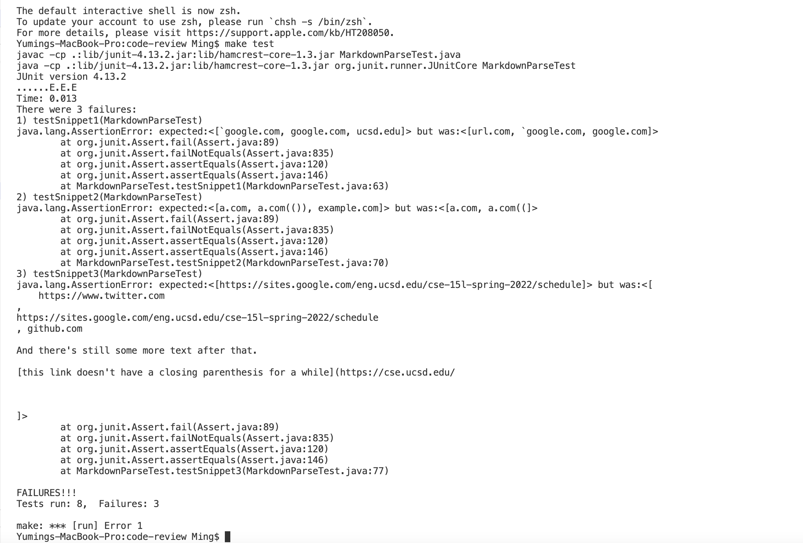

# [CSE 15L Lab Report 4](https://yuming73.github.io/cse15l-lab-reports/lab-report-4-week-8.html)    
## Snippet Code Reviews    

**[My Repository Link](https://github.com/yuming73/markdown-parser.git)**   
**[Reviewed Repository Link](https://github.com/Sking56/markdown-parser.git)**   

### Expected Output of the Snippets:    
1. Snippet 1: the expected output is ``[`google.com, google.com, ucsd.edu]``   
   
2. Snippet 2: the expected output is `[a.com, a.com(()), example.com]`   
   
3. Snippet 3: the expected output is `[https://sites.google.com/eng.ucsd.edu/cse-15l-spring-2022/schedule]`   
   

---   

### Tests in `MarkdownParseTest.java`   
* *I created a new file for each snippet and added the tests for each snippet file.*   
   
    
---   

### Output From My `MarkdownParse.java` Implementation     
* *Snippet Test 3 passed, while Test 1 and 2 failed as shown in the image below, detailing the specific JUnit output*   
   
* **Snippet Test 1 Possible Code Change:** A small code change to account for inline backticks is to check if there is backticks in front of the `closeBracket`, similarly like how an image link is checked. Another change is to check if there are brackets between the `closeBracket` and `openParen`. If so, increment the `closeBracket` to the correct outer bracket index. However, these changes are based on the visible test cases, so it might not work for some other test cases concerning inline backticks.    
* **Snippet Test 2 Possible Code Change:** A small code change to account for nest parentheses, brackets, and escaped brackets is to check if the link contains any open parenthesis (indicating that the link contains a full parenthesis). If so, the code should search again for the correct `closeParen` index. Another change is to increment the `closeParen` variable to the correct value when there are remaining close parenthesis. Since these changes are based on nest parentheses, similar code changes might need to be incorporated in the cases of nest brackets and escaped brackets.     
* **Snippet Test 3 Possible Code Change:** A small code change to account for newlines in brackets and parentheses is to check if there are any spaces within the link in the parentheses. If so, skip the iteration because it would not be a valid link with spaces. Another change is to remove any spaces before and after the link in the parentheses by using the `trim()` function. Although the tests passed after implementing these changes based on newlines in parentheses, similar code changes might need to be incorporated to account for other test cases of newlines in brackets.   

---   

### Output From Reviewed `MarkdownParse.java` Implementation   
* *All three tests for the Snippets failed as shown in the image below, detailing the specific JUnit output*   
   

---    