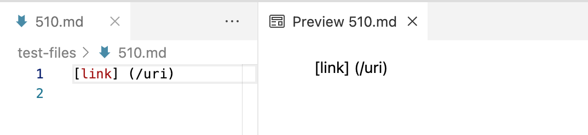
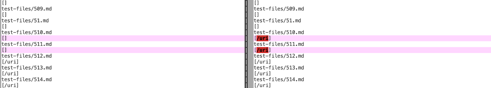
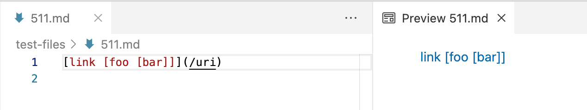

# [CSE 15L Lab Report 5](https://yuming73.github.io/cse15l-lab-reports/lab-report-5-week-10.html)    
## Comparing Implementations      

**[My Repository Link](https://github.com/yuming73/markdown-parser.git)**   
**[Provided Repository Link](https://github.com/nidhidhamnani/markdown-parser.git)**   

### Different Output #1    
1. Link to test file: [test file `510.md`](https://github.com/nidhidhamnani/markdown-parser/blob/main/test-files/510.md)   
2. Expected Output: `[]`   
   
3. Actual Output: my repository -`[]` ; provided repository - `[/uri]`   
*Found by using `vimDiff` on the result of running a bash for loop with the command `bash script.sh`. The correct implementation based on the result is my repository.*
     
4. Explanation of Bug: The code in the provided repository didn't account for spaces between the brackets and the parentheses.   

---   

### Different Output #2    
1. Link to test file: [test file `511.md`](https://github.com/nidhidhamnani/markdown-parser/blob/main/test-files/511.md)   
2. Expected Output: `[/uri]`  
   
3. Actual Output: my repository -`[]` ; provided repository - `[/uri]`   
*Found by using `vimDiff` on the result of running a bash for loop with the command `bash script.sh`. The correct implementation based on the result is the provided repository.*   
   
4. Explanation of Bug: The code in my repository didn't account for brackets within the brackets that contain the description of the link.   

---   