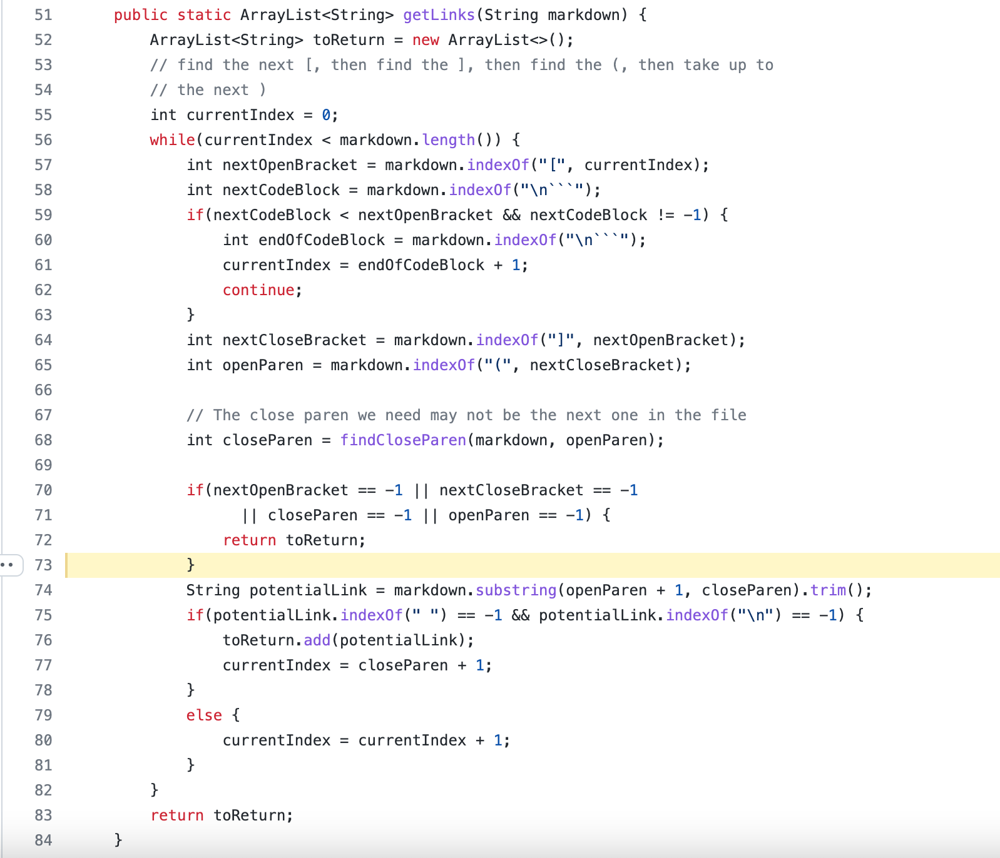
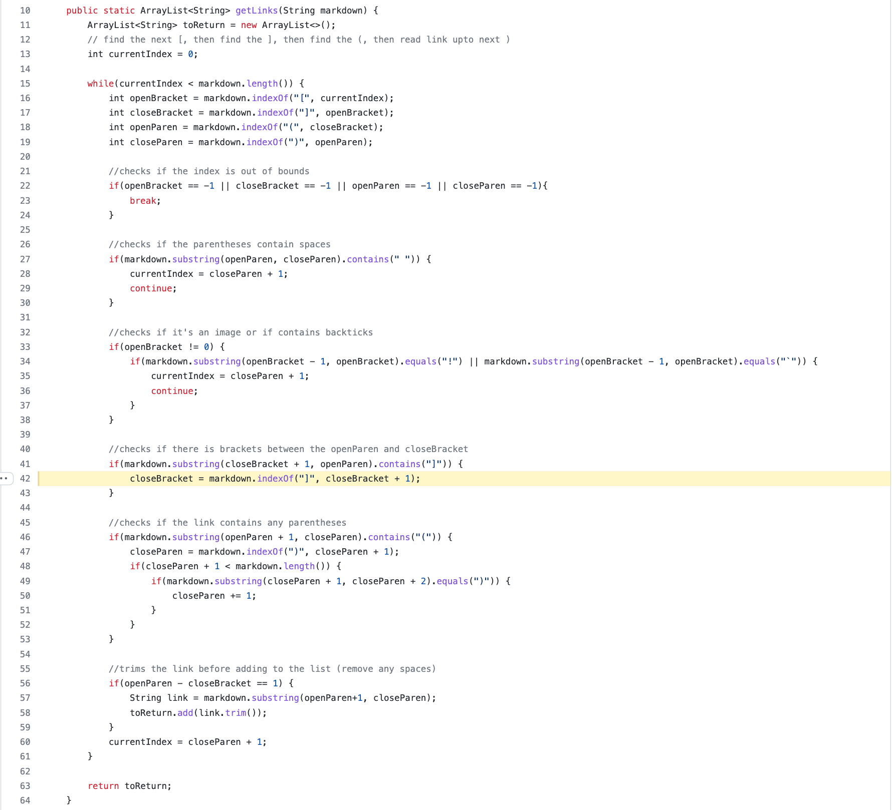

# [CSE 15L Lab Report 5](https://yuming73.github.io/cse15l-lab-reports/lab-report-5-week-10.html)    
## Comparing Implementations      

**[My Repository Link](https://github.com/yuming73/markdown-parser.git)**   
**[Provided Repository Link](https://github.com/nidhidhamnani/markdown-parser.git)**   

### Different Output #1    
1. **Link to Test File:** [`510.md`](https://github.com/nidhidhamnani/markdown-parser/blob/main/test-files/510.md)   
2. **Expected Output:** `[]`   
   
3. **Actual Output:** my repository -`[]` ; provided repository - `[/uri]`   
*Found by using `vimDiff` on the result of running a bash for loop with the command `bash script.sh`. The correct implementation based on the result is my repository.*
     
4. **Explanation of Bug:** The incorrect output is because the code in the provided repository didn't account for spaces between the brackets and the parentheses.   

---   

### Different Output #2    
1. **Link to Test File:** [`511.md`](https://github.com/nidhidhamnani/markdown-parser/blob/main/test-files/511.md)   
2. **Expected Output:** `[/uri]`  
   
3. **Actual Output:** my repository -`[]` ; provided repository - `[/uri]`   
*Found by using `vimDiff` on the result of running a bash for loop with the command `bash script.sh`. The correct implementation based on the result is the provided repository.*   
   
4. **Explanation of Bug:** The incorrect output is because the code in my repository did not account for brackets within the brackets that contain the description of the link. With the current code, after it finds that there is a close bracket after the found index, it only increments the `closeBracket` reference by one, which is not sufficient when theere are more than one additional close bracket. Therefore, this part of the code (lines 41 to 43) needs to be fixed in order to resolve the bug.    

---   