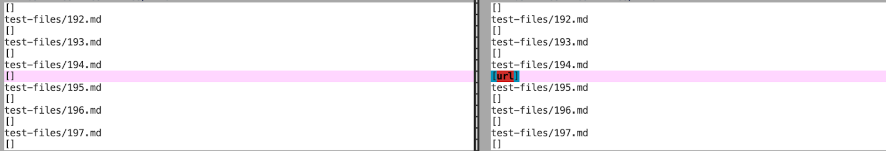

# [CSE 15L Lab Report 5](https://yuming73.github.io/cse15l-lab-reports/lab-report-5-week-10.html)    
## Comparing Implementations      

### Different Output #1    
1. Link to test file: [test file `194.md`]()   
2. Expected Output:   
   
3. Correct Implementation:   
   
4. Bug:   

---   

### Different Output #2    
1. Link to test file: [test file `511.md`]()   
2. Expected Output:   
   
3. Correct Implementation:   
   
4. Bug:   

---   